# Passos de Configuração

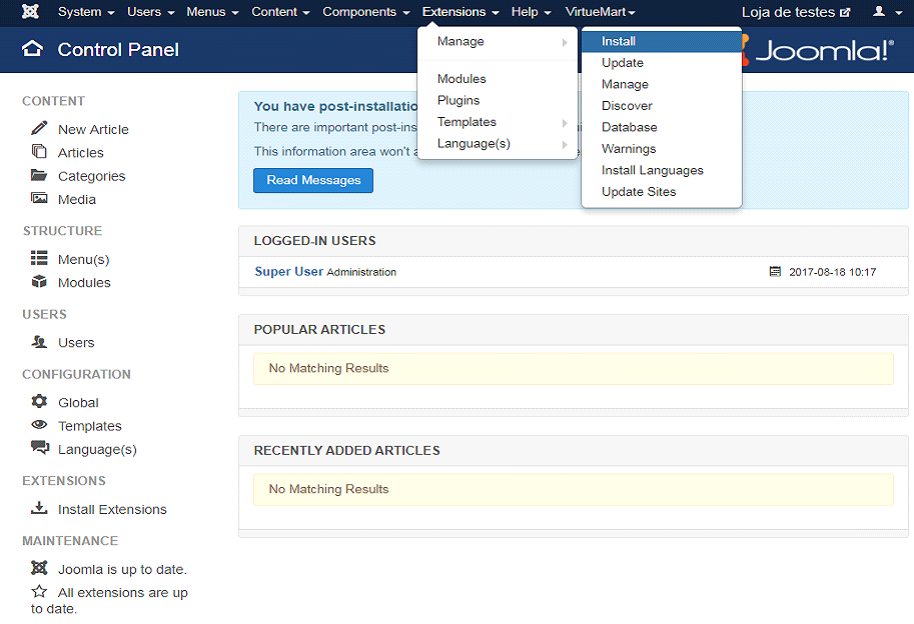

No ambiente de administração/backoffice da sua loja VirtueMart aceda ao menu ‘Extensions’> ‘Manage’ e selecione a opção ‘Install’.

A instalação poderá ser efetuada através de duas opções:

- [Instalação a partir da loja](#instalação-a-partir-da-loja)
- [Instalação a partir do upload do ficheiro](#instalação-a-partir-do-upload-do-ficheiro)

## Instalação a partir da loja

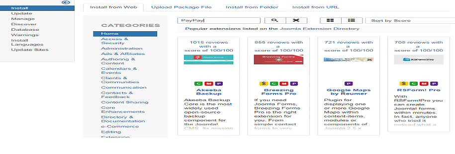

Selecione a opção ‘Install from Web’ e introduza o nome da plataforma PayPay’.

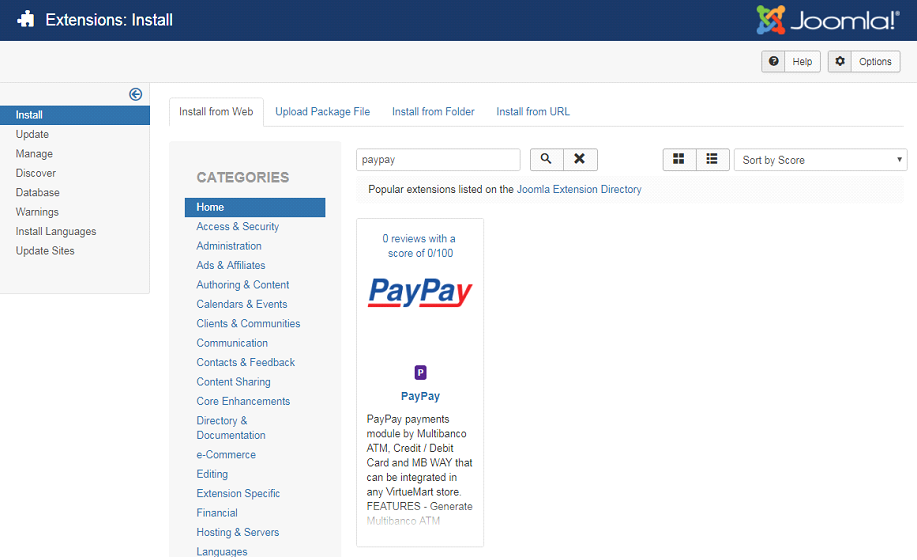

Selecione o plugin da PayPay.

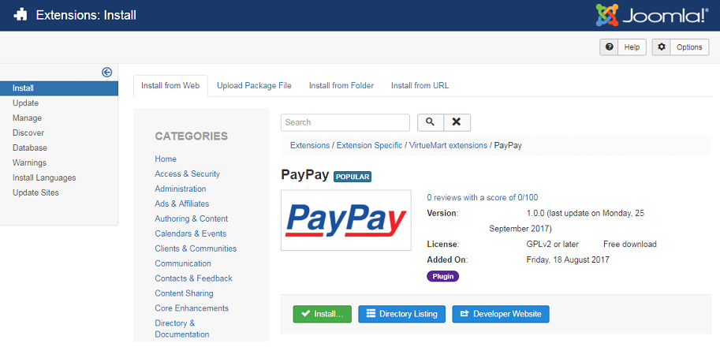

Clique em ‘Install’.

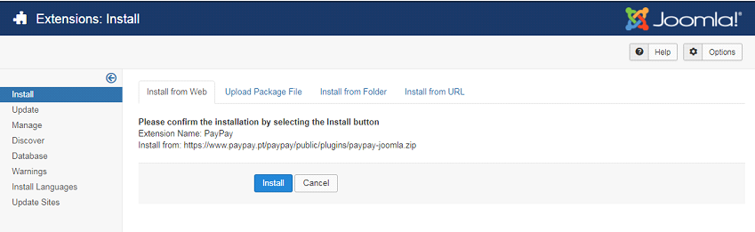

Confirme a instalação ao clicar na opção ‘Install’.

## Instalação a partir do upload do ficheiro

Selecione a opção ‘Upload Package File’

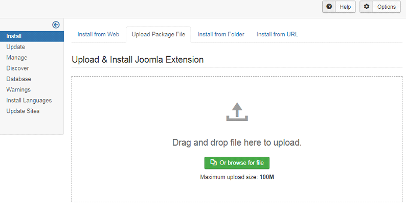

‘arraste’ o ficheiro para a área de uploads, ou então selecione o ficheiro.

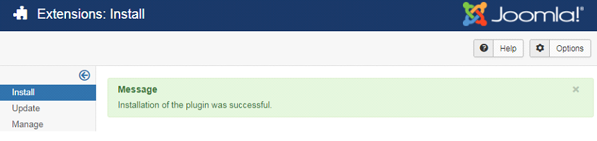

Se a instalação for executada com sucesso será apresentada a mensagem de sucesso.

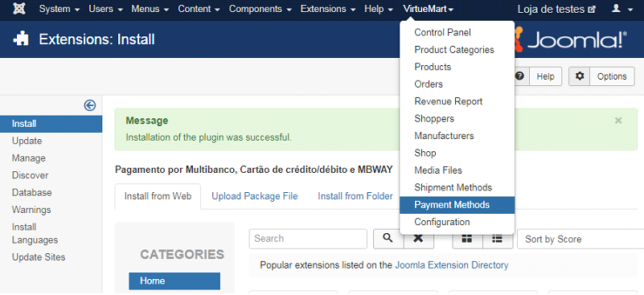

Após a instalação, aceda ao menu ‘VirtueMart’ > ‘Payment Methods’ para criar as formas de pagamento (Multibanco, Cartão de Crédito/Débito ou MB Way).

Clique em ‘New’.

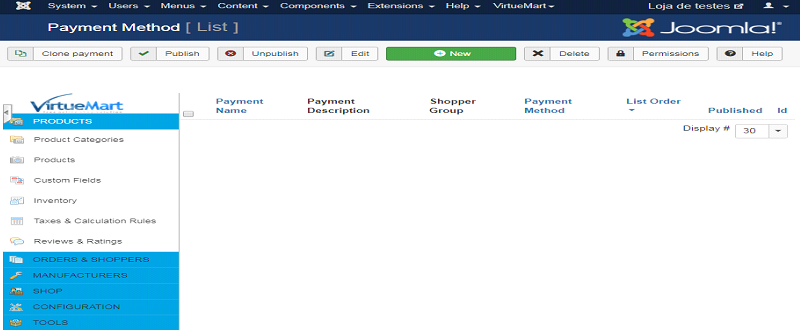

Na área ‘Payment Method Information’ preencha o formulário com os dados referentes à forma de pagamento que pretende adicionar, sendo que no campo ‘Payment Method’ deve selecionar a opção ‘PayPay’. De seguida, clique em ‘Save’.

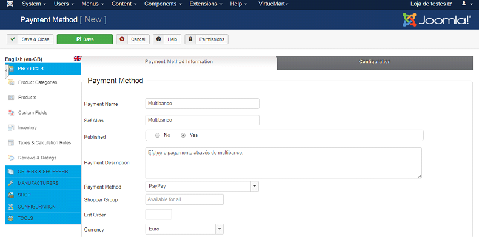

Após o passo anterior, clique na área ‘Configuration’ e introduza os dados de integração com a PayPay que são apresentados no backoffice (integrações). No final clique em ‘Save’.

:::warning

Deverá selecionar a mesma forma de pagamento que introduziu no passo anterior.

:::

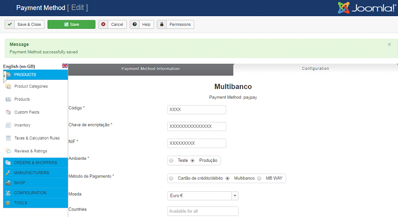

Se os dados introduzidos estiverem corretos será apresentada a mensagem de sucesso.

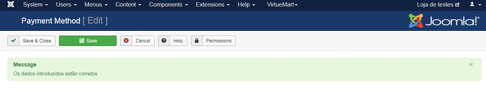

Caso contrário será apresentada a seguinte mensagem de erro.

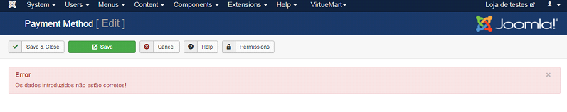

Após a configuração poderá visualizar as formas de pagamento criadas.

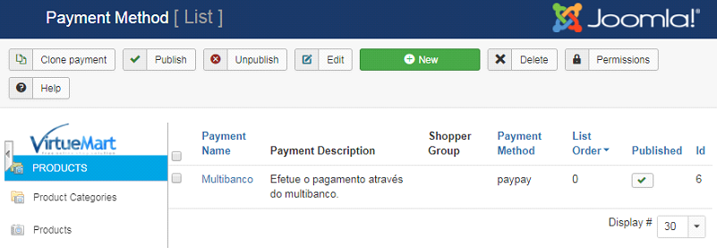

Poderá utilizar o ambiente de teste para testar a integração antes de iniciar em ambiente de produção. Para tal, deverá utilizar os seguintes dados de acesso:

<table>
    <tr>
        <td>NIF:</td>
        <td>507983807</td>
    </tr>
    <tr>
        <td>Código de Plataforma:</td>
        <td>0037</td>
    </tr>
    <tr>
        <td>Chave de encriptação:</td>
        <td>UCYNgCLV9BwjBI5FIJi7GPNI</td>
    </tr>
</table>

Aceda a https://paypay.acin.pt/paypaybeta/ e consulte o estado dos pagamentos:

<table>
    <tr>
        <td>Utilizador:</td>
        <td>virtuemart@paypaybeta.pt</td>
    </tr>
    <tr>
        <td>Password:</td>
        <td>yGj2eYVMENk4</td>
    </tr>
</table>
