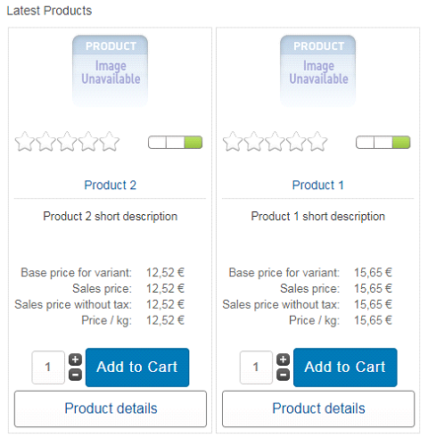
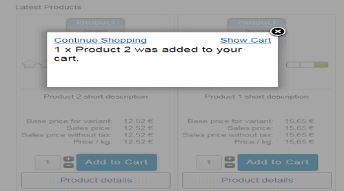
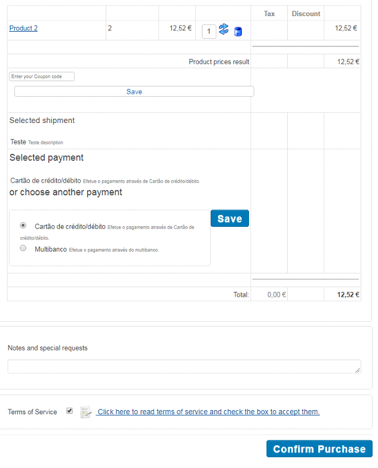
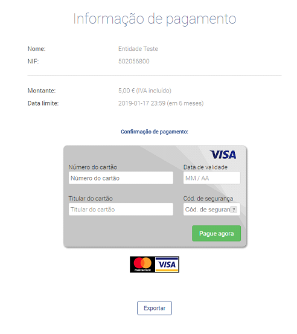
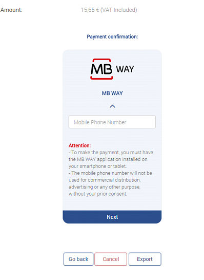
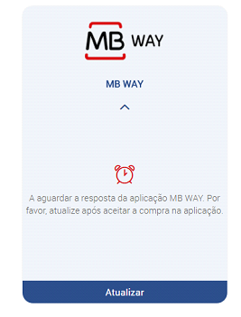
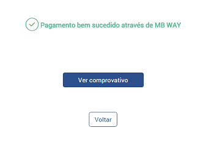
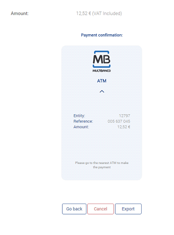

# Realizar o Pagamento da Compra

Para efetuar a compra de um produto/serviço, o cliente deverá efetuar o seu login na loja VirtueMart e adicionar artigos ao seu carrinho.

Após adicionar os artigos ao carrinho é apresentada a seguinte mensagem.

Deverá selecionar a forma de pagamento pretendida (Multibanco, Cartão de Crédito/Débito ou MB WAY), aceitar os termos em ‘Terms of service’, e no final, confirmar a compra em ‘Confirm Purchase’.

Após a confirmação da compra, o cliente será redirecionado para a área de pagamentos da PayPay. Caso a forma de pagamento escolhida seja ‘Cartão de Crédito/Débito’ deverá inserir os dados e validar.

:::info

A sua loja tratará de proceder ao envio, via e-mail, dos dados de pagamento aos seus clientes

:::

Ao efetuar o pagamento através da opção ‘MB WAY’, será redirecionado para a área de pagamentos da PayPay. Introduza o número de telemóvel associado à conta MB WAY.

Após estes passos será enviado um alerta de pagamento para o número associado. Na aplicação, autorize o pagamento e introduza o PIN MB WAY. Após efetuado o pagamento clique na opção ‘Atualizar’.

Se o pagamento for realizado com sucesso, ser-lhe-á apresentada a mensagem abaixo indicada. Ao clicar em ‘Voltar’ será redirecionado para a sua loja VirtueMart. Para obter o comprovativo de pagamento, clique na opção disponibilizada ‘Ver comprovativo’.

Ao selecionar a opção ‘Multibanco’, é gerada a referência para pagamento do valor exato da encomenda. Nesta área poderá apenas consultar o resumo da sua compra.

