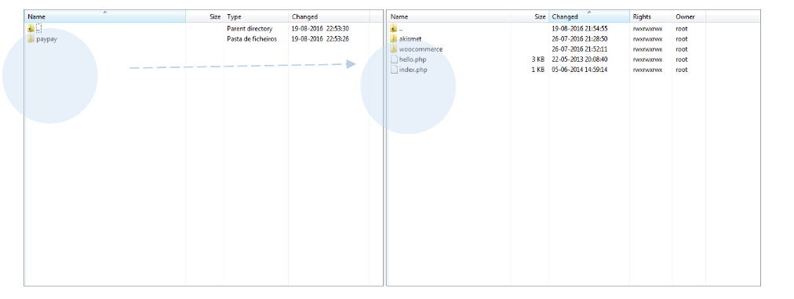
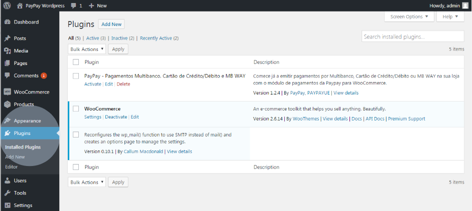
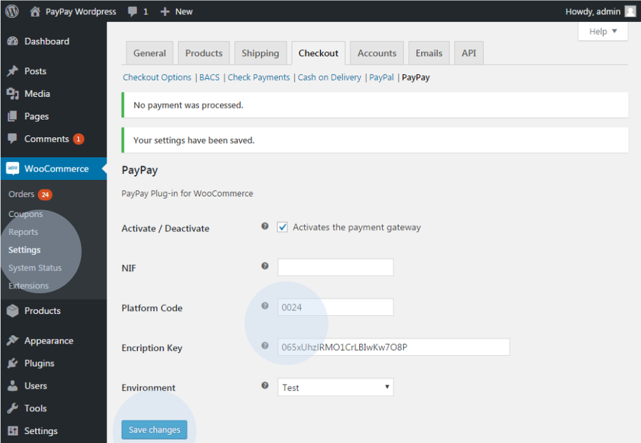

# Passos de configuração

Em seguida, copie os ficheiros fornecidos pela PayPay para a sua pasta de plugins do WordPress

    
<svg viewBox="0 0 14 16"><path fill-rule="evenodd" d="M7 2.3c3.14 0 5.7 2.56 5.7 5.7s-2.56 5.7-5.7 5.7A5.71 5.71 0 0 1 1.3 8c0-3.14 2.56-5.7 5.7-5.7zM7 1C3.14 1 0 4.14 0 8s3.14 7 7 7 7-3.14 7-7-3.14-7-7-7zm1 3H6v5h2V4zm0 6H6v2h2v-2z"></path></svg>info

    

        
Caso existam outros módulos de pagamento instalados, deverá se certificar que não existe nenhum ficheiro sobreposto ao existente

    

No ambiente de administração/backoffice da sua loja e-commerce aceda ao menu ‘Plugins’ e selecione a opção ‘Plugins instalados’.

Nesta área é possível visualizar o módulo de pagamentos da PayPay (Multibanco, Cartão de Crédito/Débito e MB WAY). Ative o plugin da PayPay.

Clique na opção ‘Definições’ e preencha os campos com os dados da PayPay, que pode obter em ‘Configurar´ > ‘Integrações’ > ‘Plataformas de Integração’ > ‘Adicionar’ (Extensão WooCommerce), e no final, selecione a opção ‘Guardar’.

Poderá utilizar o ambiente de teste para testar a integração antes de iniciar em ambiente de produção. Para tal, deverá utilizar os seguintes dados de acesso:

<table>
    <tr>
        <td>NIF</td>
        <td></td>
    </tr>
    <tr>
        <td>Código de Plataforma:</td>
        <td>0009</td>
    </tr>
    <tr>
        <td>Chave de encriptação:</td>
        <td>4F16A63E4ABA1</td>
    </tr>
</table>

Aceda a https://paypay.acin.pt e consulte o estado dos pagamentos:

<table>
    <tr>
        <td>Utilizador:</td>
        <td>woocommerce@paypaybeta.pt</td>
    </tr>
    <tr>
        <td>Password:</td>
        <td>DPdZesMkpx</td>
    </tr>
</table>

Após a configuração, é possível verificar se possui pagamentos pendentes.

A imagem seguinte apresenta a página de entrada da sua loja WooCommerce. Caso não tenha nenhum artigo disponível, deverá criá-lo na sua área de administração.

    
<svg viewBox="0 0 14 16"><path fill-rule="evenodd" d="M7 2.3c3.14 0 5.7 2.56 5.7 5.7s-2.56 5.7-5.7 5.7A5.71 5.71 0 0 1 1.3 8c0-3.14 2.56-5.7 5.7-5.7zM7 1C3.14 1 0 4.14 0 8s3.14 7 7 7 7-3.14 7-7-3.14-7-7-7zm1 3H6v5h2V4zm0 6H6v2h2v-2z"></path></svg>info

    

        
A sua loja agora está apta para gerar e fornecer os dados de pagamento aos seus clientes, em tempo real, de acordo com o método de pagamento escolhido (Multibanco, Cartão de Crédito/Débito e MB WAY). 
        Caso surja alguma dúvida, não hesite em contactar-nos. Estamos disponíveis para ajudar na configuração.

    

