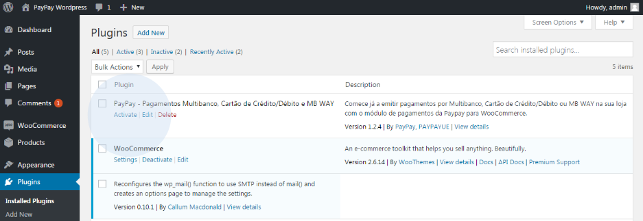

# Woo-comerce

## [Download](https://wordpress.org/plugins/paypay-pagamentos-multibanco-e-cartao-de-creditodebito/)

import Tabs from '@theme/Tabs';
import TabItem from '@theme/TabItem';

<Tabs>
    <TabItem value="Requisitos" label="Requisitos" default>
        Para instalar a extensão com a PayPay:
        - O comerciante deverá estar registado na plataforma PayPay;
        - Deverá efetuar o download da versão 4.7.3 do WordPress, disponível em
        https://wordpress.org/download/;
        - Instalar o plugin do WooCommerce no seu computador, disponível em
        https://paypay.pt/paypay/public/plugins/paypay-woocommerce.zip;
        - Após a instalação concluída e a loja configurada, aceda à área de administração e efetue o seu login.

        
    </TabItem>

    <TabItem value="Passos de configuração" label="Passos de configuração">
        Em seguida, copie os ficheiros fornecidos pela PayPay para a sua pasta de plugins do WordPress

        

        

            
<svg viewBox="0 0 14 16"><path fill-rule="evenodd" d="M7 2.3c3.14 0 5.7 2.56 5.7 5.7s-2.56 5.7-5.7 5.7A5.71 5.71 0 0 1 1.3 8c0-3.14 2.56-5.7 5.7-5.7zM7 1C3.14 1 0 4.14 0 8s3.14 7 7 7 7-3.14 7-7-3.14-7-7-7zm1 3H6v5h2V4zm0 6H6v2h2v-2z"></path></svg>info

            

                
Caso existam outros módulos de pagamento instalados, deverá se certificar que não existe nenhum ficheiro sobreposto ao existente

            

        

        No ambiente de administração/backoffice da sua loja e-commerce aceda ao menu ‘Plugins’ e selecione a opção ‘Plugins instalados’.

        

        Nesta área é possível visualizar o módulo de pagamentos da PayPay (Multibanco, Cartão de Crédito/Débito e MB WAY). Ative o plugin da PayPay.

        

        Clique na opção ‘Definições’ e preencha os campos com os dados da PayPay, que pode obter em ‘Configurar´ > ‘Integrações’ > ‘Plataformas de Integração’ > ‘Adicionar’ (Extensão WooCommerce), e no final, selecione a opção ‘Guardar’.

        

        Poderá utilizar o ambiente de teste para testar a integração antes de iniciar em ambiente de produção. Para tal, deverá utilizar os seguintes dados de acesso:

        <table>
            <tr>
                <td>NIF</td>
                <td></td>
            </tr>
            <tr>
                <td>Código de Plataforma:</td>
                <td>0009</td>
            </tr>
            <tr>
                <td>Chave de encriptação:</td>
                <td>4F16A63E4ABA1</td>
            </tr>
        </table>

        Aceda a https://paypay.acin.pt e consulte o estado dos pagamentos:

        <table>
            <tr>
                <td>Utilizador:</td>
                <td>woocommerce@paypaybeta.pt</td>
            </tr>
            <tr>
                <td>Password:</td>
                <td>DPdZesMkpx</td>
            </tr>
        </table>

        Após a configuração, é possível verificar se possui pagamentos pendentes.

        

        A imagem seguinte apresenta a página de entrada da sua loja WooCommerce. Caso não tenha nenhum artigo disponível, deverá criá-lo na sua área de administração.

        

        

            
<svg viewBox="0 0 14 16"><path fill-rule="evenodd" d="M7 2.3c3.14 0 5.7 2.56 5.7 5.7s-2.56 5.7-5.7 5.7A5.71 5.71 0 0 1 1.3 8c0-3.14 2.56-5.7 5.7-5.7zM7 1C3.14 1 0 4.14 0 8s3.14 7 7 7 7-3.14 7-7-3.14-7-7-7zm1 3H6v5h2V4zm0 6H6v2h2v-2z"></path></svg>info

            

                
A sua loja agora está apta para gerar e fornecer os dados de pagamento aos seus clientes, em tempo real, de acordo com o método de pagamento escolhido (Multibanco, Cartão de Crédito/Débito e MB WAY). 
                Caso surja alguma dúvida, não hesite em contactar-nos. Estamos disponíveis para ajudar na configuração.

            

        

    </TabItem>

    <TabItem value="Realizar o pagamento da compra" label="Realizar o pagamento da compra">
        Para efetuar a compra de um produto/serviço, o cliente deverá efetuar o seu login na loja WooCommerce.

        

        Adicionar artigos ao seu carrinho.

        

        Para confirmar a compra, deverá clicar em ‘Checkout’.

        

        Após o preenchimento dos dados de entrega, deverá selecionar o tipo de pagament (Multibanco, Cartão de Crédito/Débito ou MB WAY).

        

        

            
<svg viewBox="0 0 14 16"><path fill-rule="evenodd" d="M7 2.3c3.14 0 5.7 2.56 5.7 5.7s-2.56 5.7-5.7 5.7A5.71 5.71 0 0 1 1.3 8c0-3.14 2.56-5.7 5.7-5.7zM7 1C3.14 1 0 4.14 0 8s3.14 7 7 7 7-3.14 7-7-3.14-7-7-7zm1 3H6v5h2V4zm0 6H6v2h2v-2z"></path></svg>info

            

                
As configurações respeitantes às formas de pagamento deverão ser definidas na área de cliente da PayPay. Poderá também definir os montantes mínimos e máximos para as diferentes formas de pagamento e assim obter maior controlo nos limites.

            

        

        Ao selecionar a opção ‘Multibanco’, é gerada a referência para pagamento do valor exato da encomenda. Nesta área poderá consultar o resumo da sua compra.

        

        Ao aceder ao histórico de encomendas, é possível visualizar os detalhes da encomenda que acabou de efetuar

        

        Nos detalhes da última encomenda que efetuou, pode visualizar a referência de pagamento gerada pela Paypay.

        

        Após realizar o pagamento da encomenda, é apresentada a mensagem de sucesso e o estadoda encomenda é devidamente atualizado.

        

        Caso o cliente tenha selecionada a opção de pagamento por ‘Cartão de Crédito/Débito’, será redirecionado para a área de pagamentos da PayPay. Deverá inserir os dados do seu cartão de crédito e validar.

        

        Ao aceder à loja WooCommerce poderá confirmar que o estado da sua encomenda foi devidamente atualizado.

        

        

            
<svg viewBox="0 0 14 16"><path fill-rule="evenodd" d="M7 2.3c3.14 0 5.7 2.56 5.7 5.7s-2.56 5.7-5.7 5.7A5.71 5.71 0 0 1 1.3 8c0-3.14 2.56-5.7 5.7-5.7zM7 1C3.14 1 0 4.14 0 8s3.14 7 7 7 7-3.14 7-7-3.14-7-7-7zm1 3H6v5h2V4zm0 6H6v2h2v-2z"></path></svg>info

            

                
A sua loja tratará de proceder ao envio, via e-mail, dos dados de pagamento aos seus clientes.

            

        

        Ao efetuar o pagamento através da opção ‘MB WAY’, será redirecionado para a área de pagamentos da PayPay.

        

        Introduza o número de telemóvel associado à conta MB WAY.

        

        Após estes passos será enviado um alerta de pagamento para o número associado. Na aplicação, autorize o pagamento e introduza o PIN MB WAY. Após efetuado o pagamento clique na opção ‘Atualizar’.

        

        Se o pagamento for realizado com sucesso, ser-lhe-á apresentada a mensagem abaixo indicada. Ao clicar em ‘Voltar’ será redirecionado para a sua loja WooCommerce. Para obter o comprovativo de pagamento, clique na opção disponibilizada.

        
    </TabItem>

    <TabItem value="Atualizar os pagamentos manualmente" label="Atualizar os pagamentos manualmente">
        Todos os pagamentos são processados automaticamente. No entanto, caso verifique alguma situação em que o pagamento tenha sido efetuado e o estado da compra não tenha sido alterado, o administrador poderá fazê-lo manualmente. Para tal, deverá aceder à área de administração da loja WooCommerce, aceder ao separador ‘Plugins’ e selecionar a opção ‘Guardar’, na área de configuração do plugin.

        

        

            
<svg viewBox="0 0 14 16"><path fill-rule="evenodd" d="M7 2.3c3.14 0 5.7 2.56 5.7 5.7s-2.56 5.7-5.7 5.7A5.71 5.71 0 0 1 1.3 8c0-3.14 2.56-5.7 5.7-5.7zM7 1C3.14 1 0 4.14 0 8s3.14 7 7 7 7-3.14 7-7-3.14-7-7-7zm1 3H6v5h2V4zm0 6H6v2h2v-2z"></path></svg>info

            

                
O estado das encomendas é alterado de forma automática após o pagamento ser efetuado.

            

        

    </TabItem>

    <TabItem value="Problemas conhecidos" label="Problemas conhecidos">
        <h2>Layout baseado em blocos na página de checkout WooCommerce</h2>

        O plugin WooCommerce da PayPay não oferece suporte ao layout de checkout em blocos. Se estiver utilizando este tipo de layout, as formas de pagamento não serão apresentadas na página de checkout. É necessário alterar a seção de checkout para usar o modo de checkout clássico. Para fazer isso, siga as etapas abaixo:

        1. Na página de administração do WordPress, encontre a página de checkout e cliqueem editar.

        

        2. Após ser apresentada a edição da página é necessário selecionar o bloco associado as formas de pagamento.

        

        3. Caso a página de checkout estiver utilizando o layout de checkout em blocos, aparecerá um aviso no painel direito da página de edição. Clique em “Mudar para layout clássico” e depois clique em “Atualizar” para que as alterações sejam guardadas. Agora já deverá aparecer as formas de pagamento ao realizar um checkout.

        

        <h2>Armazenamento de pedidos de alta performance</h2>

        O plugin WooCommerce da PayPay não ofere compatibilidade com o armazenamento de pedidos de alta performance. Se estiver a utilizar este tipo de armazenamento é necessário alterar para o “WordPress posts storage (legacy)” e guardar as alterações.

        

    </TabItem>
</Tabs>
